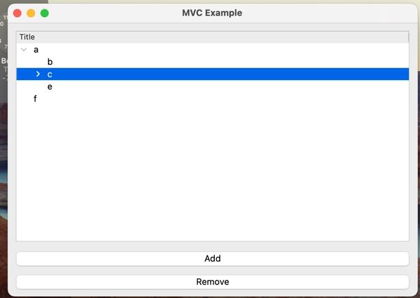
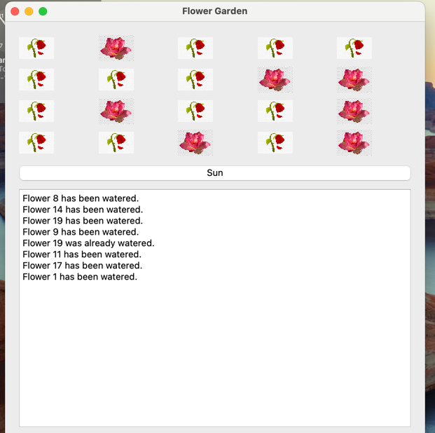
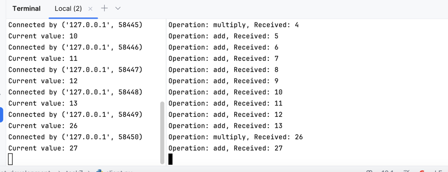

# iot_development-

## 1 -2 task
реализовал в Jupiter notebook

## 3 -5 task 
интерфейс задач 3 -5

## task 6
Версия с QT и консольная версия 

## task 7

Сервер принимает запросы на  +1 и * 2, 
обрабатывает их в многопоточном режиме,
возвращает новое значение. 
Клиенты один отправляет запрос на добавление каждую секунду, второй  – на умножение каждые 10 секунд, выводят полученное значение вк онсоль.
